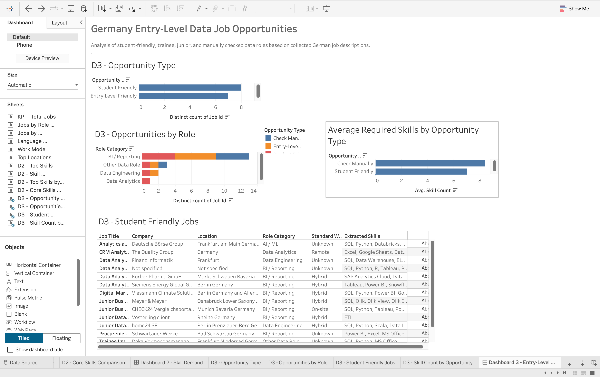
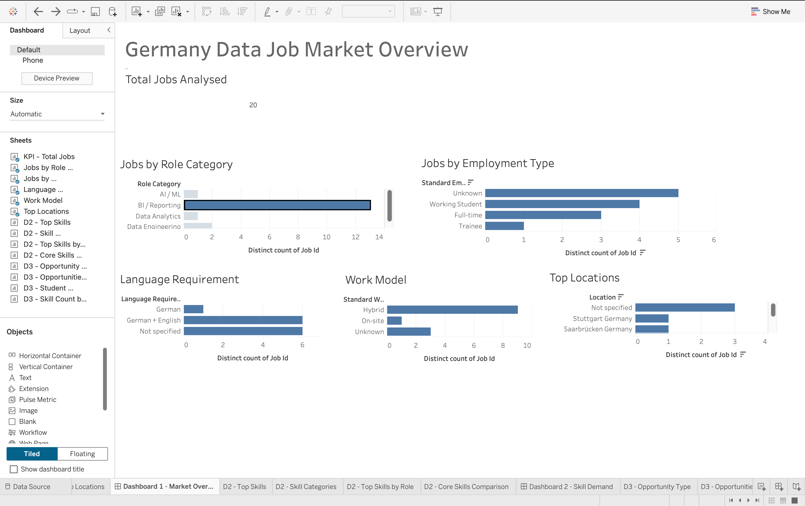
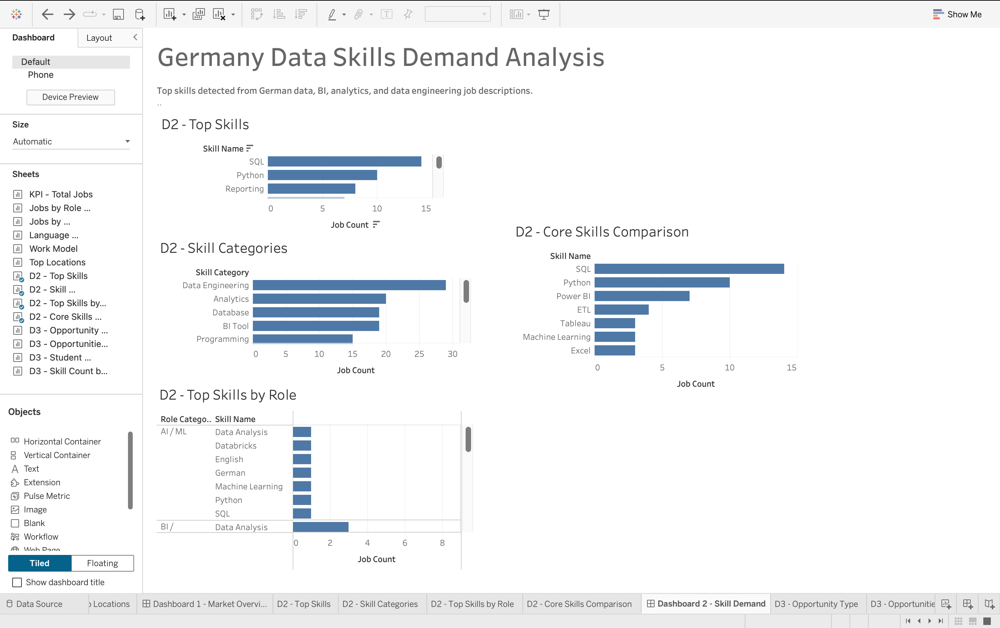

# Germany Data Talent Intelligence Platform

## Public Data Notice

This repository contains a **public-safe version** of the project.

Full raw job descriptions are **not included** in this public repository. The `public_data/` folder contains processed and aggregated datasets without full job-description text.

The private working version includes the full raw collection and complete local pipeline.

---

## 1. Business Problem

Fresh graduates and entry-level candidates in Germany often struggle to understand which data, BI, analytics, and AI skills are currently demanded by employers.

Job descriptions are spread across multiple platforms, making it difficult to compare:

- Required skills
- Role categories
- Employment types
- Work models
- Language requirements
- Entry-level and working-student opportunities

This project solves that problem by transforming real German data-related job postings into structured labour-market insights.

---

## 2. Project Objective

The objective of this project is to build a corporate-style data analytics workflow that converts job-market information into useful business and career insights.

The project answers questions such as:

- Which skills are most demanded in German data jobs?
- Which roles are most common: BI, Data Analytics, Data Engineering, or AI/ML?
- Which jobs are suitable for working students or entry-level candidates?
- Which tools appear most often in job descriptions?
- How important are SQL, Python, Tableau, Power BI, reporting, and data analysis?
- Which language requirements appear in job descriptions?
- Which work models are common: hybrid, remote, on-site, or unspecified?

---

## 3. Data Source

The dataset was manually collected from real German job descriptions related to roles such as:

- Working Student Data Analyst
- Working Student Business Intelligence
- Working Student Data Analytics
- Junior Data Analyst
- Junior Business Intelligence Analyst
- Junior Data Engineer
- Data Analytics Consultant
- BI / Reporting roles
- Data Engineering and analytics support roles

For public safety, the full raw job-description text is excluded from this repository.

The public-safe data includes structured fields such as:

- Job title
- Company
- Location
- Employment type
- Work model
- Role category
- Language requirement
- Extracted skills
- Skill count
- Aggregated SQL analysis outputs

---

## 4. Tech Stack

| Area | Technology |
|---|---|
| Data collection | Manual structured collection |
| Data cleaning | Python, pandas |
| Skill extraction | Python, regex, rule-based matching |
| SQL analysis | DuckDB SQL |
| BI dashboard | Tableau |
| Version control | Git, GitHub |
| Public data preparation | Python, pandas |
| Future extension | PostgreSQL, Streamlit, Docker |

---

## 5. Project Architecture

```text
Raw job descriptions
        ↓
Python data cleaning
        ↓
Skill extraction pipeline
        ↓
Processed job dataset
        ↓
SQL analysis with DuckDB
        ↓
Tableau-ready datasets
        ↓
Tableau dashboards
        ↓
Business insights and career strategy
```

Public version:

```text
Private raw data
        ↓
Processed public-safe datasets
        ↓
Aggregated analysis outputs
        ↓
Public GitHub documentation
        ↓
Tableau dashboard portfolio
```

---

## 6. Public Repository Structure

```text
germany-data-talent-intelligence-public/
│
├── public_data/
│   ├── public_jobs.csv
│   ├── public_job_skills.csv
│   ├── public_top_skills.csv
│   ├── public_role_category_analysis.csv
│   ├── public_employment_type_analysis.csv
│   ├── public_language_requirement_analysis.csv
│   ├── public_skill_by_role_analysis.csv
│   └── public_entry_level_opportunities.csv
│
├── src/
│   ├── clean_jobs.py
│   ├── extract_skills.py
│   ├── run_sql_analysis.py
│   ├── prepare_tableau_data.py
│   └── create_public_data.py
│
├── sql/
│   ├── top_skills.sql
│   ├── role_category_analysis.sql
│   ├── employment_type_analysis.sql
│   ├── language_requirement_analysis.sql
│   ├── skill_by_role_analysis.sql
│   └── entry_level_opportunities.sql
│
├── dashboard/
│   └── screenshots/
│
├── requirements.txt
├── .gitignore
└── README.md
```

---

## 7. Data Pipeline

### Step 1: Raw Data Collection

Real German data-related job descriptions were collected manually and structured into a local private dataset.

The private raw dataset contains:

- Job title
- Company
- Location
- Employment type
- Work model
- Source
- Date collected
- Job description

The full raw job descriptions are not published in this repository.

---

### Step 2: Data Cleaning

The script `src/clean_jobs.py` cleans and standardizes the raw data.

It creates:

- Clean job titles
- Clean locations
- Standardized employment types
- Standardized work models
- Role categories
- Language requirements
- Description length checks

Main cleaning logic includes:

- Text normalization
- Employment type standardization
- Work model standardization
- Role category detection
- Language requirement detection

---

### Step 3: Skill Extraction

The script `src/extract_skills.py` extracts technical and business skills from job descriptions using rule-based matching.

Detected skills include examples such as:

- SQL
- Python
- Tableau
- Power BI
- Reporting
- Data Analysis
- ETL
- Machine Learning
- Data Warehouse
- English
- German
- MS Office

The output creates a job-skill mapping table that can be used for SQL analysis and Tableau dashboards.

---

### Step 4: SQL Analysis

DuckDB SQL is used to analyse the processed datasets.

The SQL layer answers questions such as:

- Which skills appear most often?
- Which role categories are most common?
- Which employment types appear in the dataset?
- Which language requirements are mentioned?
- Which skills are most common by role category?
- Which jobs are student-friendly or entry-level friendly?

SQL files are stored in:

```text
sql/
```

---

### Step 5: Tableau Data Preparation

The script `src/prepare_tableau_data.py` prepares clean CSV files for dashboarding.

The public-safe data files are stored in:

```text
public_data/
```

These files exclude full job-description text and are suitable for public portfolio use.

---

## 8. Tableau Dashboards

The project includes three Tableau dashboard pages.

### Dashboard 1: Germany Data Job Market Overview

This dashboard shows:

- Total jobs analysed
- Jobs by role category
- Jobs by employment type
- Language requirements
- Work model distribution
- Top locations

---

### Dashboard 2: Germany Data Skills Demand Analysis

This dashboard shows:

- Top demanded skills
- Skill demand by category
- Core skills comparison
- Top skills by role category

---

### Dashboard 3: Germany Entry-Level Data Job Opportunities

This dashboard shows:

- Student-friendly opportunities
- Entry-level friendly jobs
- Opportunities by role category
- Average skill count by opportunity type
- Job table for application prioritization

---

## 9. Public Data Files

The public-safe datasets are stored in:

```text
public_data/
```

### Main public files

| File | Description |
|---|---|
| `public_jobs.csv` | Public-safe job-level dataset without full job-description text |
| `public_job_skills.csv` | Job-to-skill mapping table |
| `public_top_skills.csv` | Aggregated top skills analysis |
| `public_role_category_analysis.csv` | Role category distribution |
| `public_employment_type_analysis.csv` | Employment type distribution |
| `public_language_requirement_analysis.csv` | Language requirement distribution |
| `public_skill_by_role_analysis.csv` | Top skills by role category |
| `public_entry_level_opportunities.csv` | Entry-level and student-friendly opportunity analysis |

---

## 10. Key Initial Findings

Based on the first sample of 20 German data-related job postings:

- SQL appeared as one of the most frequently requested skills.
- Python was strongly represented across data, BI, and data engineering roles.
- BI and reporting roles were common among the collected postings.
- Power BI, Tableau, reporting, and data analysis appeared frequently in business-focused roles.
- Working Student roles were a meaningful entry point for fresher-level candidates.
- Advanced AI/ML roles appeared less frequently than BI, reporting, analytics, and data engineering support roles.
- English and German language requirements appeared in several job descriptions.

Note: These findings are based on an initial sample and will become more reliable as more job postings are added.

---

## 11. Business Impact

This project demonstrates how raw job descriptions can be transformed into practical labour-market intelligence.

The analysis can help:

- Entry-level candidates prioritize the right skills
- Career advisors understand market demand
- Universities identify practical skill gaps
- Recruiters compare role requirements
- Job seekers decide which roles are realistic based on skill match

---

## 12. How to Use This Public Version

This public repository is intended to demonstrate:

- Project workflow
- Python data-cleaning logic
- Skill extraction logic
- SQL analysis logic
- Public-safe processed datasets
- Tableau dashboard outputs
- GitHub documentation structure

The public-safe datasets are available in:

```text
public_data/
```

The original raw job descriptions are not included for copyright and data-safety reasons.

---

## 13. Run the Code Locally

Install dependencies:

```bash
pip install -r requirements.txt
```

The full private pipeline requires the private raw dataset, which is not included in this public repository.

For reviewing the public version, use the files in:

```text
public_data/
```

---

## 14. SQL Analysis Files

The SQL analysis logic is stored in:

```text
sql/
```

Main SQL files:

- `top_skills.sql`
- `role_category_analysis.sql`
- `employment_type_analysis.sql`
- `language_requirement_analysis.sql`
- `skill_by_role_analysis.sql`
- `entry_level_opportunities.sql`

These queries were used to generate the aggregated analysis files in `public_data/`.

---

## 15. Dashboard Screenshots

Dashboard screenshots can be stored in:

```text
dashboard/screenshots/
```

Suggested screenshot files:

```text
dashboard_1_market_overview.png
dashboard_2_skill_demand.png
dashboard_3_entry_level_opportunities.png
```

If screenshots are added, they can be displayed here:

### Dashboard 1: Market Overview

<!--  -->

### Dashboard 2: Skill Demand

<!--  -->

### Dashboard 3: Entry-Level Opportunities

<!--  -->

---

## 16. Future Improvements

Planned improvements:

- Increase dataset size from 20 jobs to 100+ jobs
- Add PostgreSQL database storage
- Add Streamlit job-matching app
- Add CV-to-job matching score
- Add Docker for reproducible setup
- Add automated data validation tests
- Add more advanced NLP for skill extraction
- Add city-level and salary analysis if data becomes available
- Add more public Tableau dashboard screenshots

---

## 17. Project Status

Current status:

```text
Completed:
- Raw data collection for initial sample
- Python cleaning pipeline
- Rule-based skill extraction
- DuckDB SQL analysis
- Tableau-ready data preparation
- Three Tableau dashboard pages
- Public-safe dataset creation
- Public GitHub documentation

Next:
- Publish Tableau dashboard safely
- Add Tableau Public link
- Expand dataset
- Add Streamlit job-matching app
```

---

## 18. Author

**Jaykumar Dhola**  
Data Science & AI Graduate based in Germany  
GitHub: [JayDhola111](https://github.com/JayDhola111)  
LinkedIn: [jay-dhola](https://linkedin.com/in/jay-dhola)
